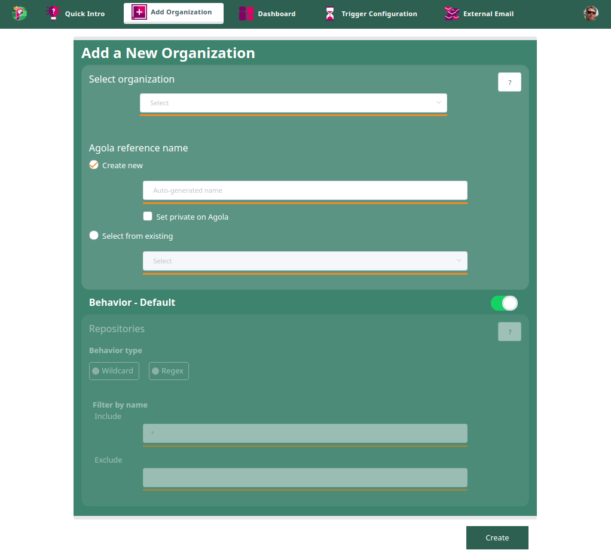

# Add Organization

You can add any avaiable organization that is previously created in your git source.

* Organization Name: `Click on Select to see a list of all organizations available on your git source`

* Agola reference name: `It's possible to have a new organization name or select from a previously created one`

* Behaviour: `This option by default selects all repositories or you can specify a filter`

* Create: `Clicking on Create, Papagaio will create the organization in Agola with all members and owners respectively`

