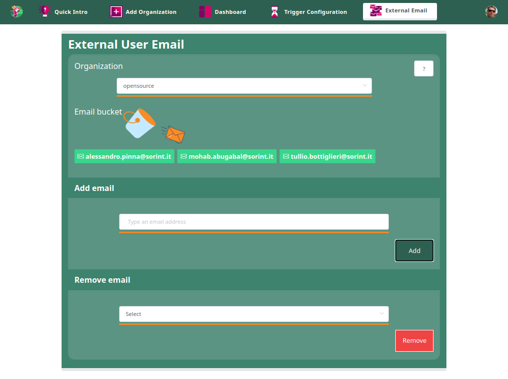

# External Email

By default Papagaio has the ability to send an e-mail when a Run is failed to:

* the project's owners 
* who commits 

If it's necessary to add some external e-mails, you can do it here.

