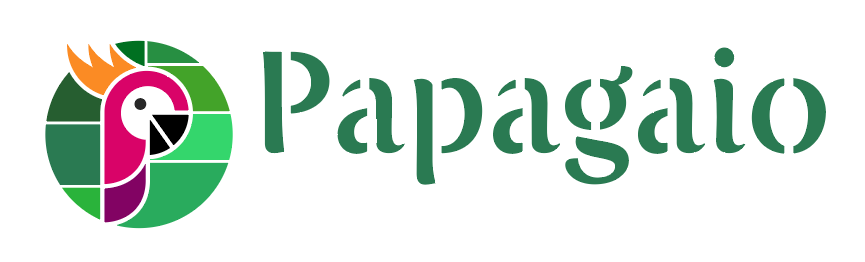

# Welcome

Papagaio was created to speed up your work on Agola. By automating the process of adding organizations, projects, branches, & members to Agola. Optionally offering the ability to specify a build strategy. Plus, setting intervals for both, synchronizing organization’s projects & members, along with recovering failed runs of projects.