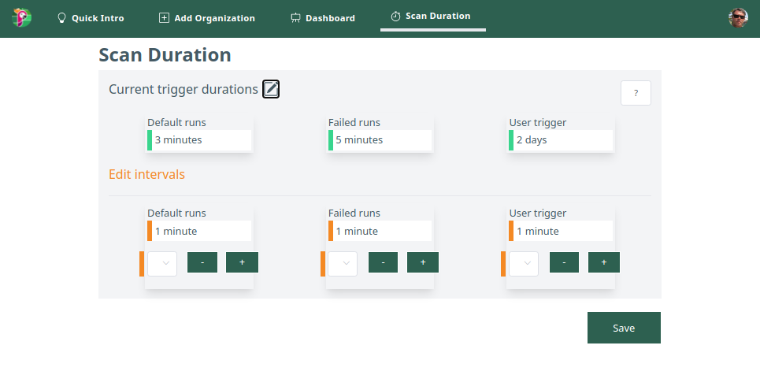

# Triggers Configuration

Papagaio synchronizes information between Agola and the Gitsources and here you can configure the time interval. 
Also this is necessary to be aligned in case of communication problems between the systems.

* Organizations trigger: 

  To synchronize all Organizations projects/branches with Agola for all repositories in Papagaio.

  This function also verify if a project has Agola's folder (.agola) to be added in the Dashboard. 

  Delete projects that no longer have the Agola's folder

  Papagaio takes care if a webhook fails, this trigger fixes it.  

* Failed runs trigger: 

  Updates info in the Dashboard.
  Send an e-mail to the person who executed the "push", to all the project owners and an external user (external user is under construction)
 
  Synchronizes with Agola : date, time duration and the url link of every last succeded/failed run of all branches in Papagaio.
  This trigger keeps the last 10 runs ordered by date to manage the e-mail sending. 

* User trigger:

  Synchronizes all users like if a user is deleted from git it also deletes in Papagaio.
  if the user is no longer owner (or deleted in git), another user who is owner is connected to the organization is assigned.
  Refreshes access tokens (expiration)

This page can be edited only by an administrator

